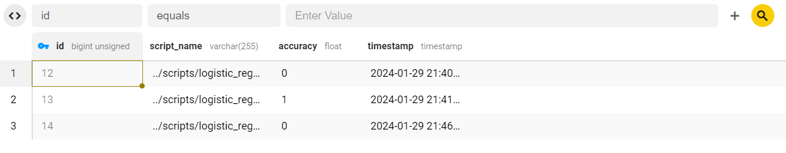

Adavanced Data Analysis CLI  Framework
============================================

Overview
--------

Welcome to this framework for an Adavanced Data Analysis CLI tool , a comprehensive and extensible framework designed to streamline advanced data analysis tasks through a command-line interface. Serving as a versatile toolkit, this framework empowers users to conduct a wide range of analyses, from generic statistical computations to specific data analytics. Its modular architecture allows for easy integration of custom analysis methods, making it a flexible solution for both general and domain-specific data analysis needs. A powerful command-line interface designed for advanced data analysis, this tool is built with a focus on  engineering principles, providing a robust and extensible platform.

Features
--------

-   **Modular Structure:** The tool is structured with modularity in mind, allowing easy integration of new analysis methods and database interactions. The codebase is organized into distinct modules, making it scalable and maintainable.

-   **Database Interaction:** Seamlessly connect to MySQL databases for storing and retrieving analysis results. The tool encapsulates database interactions in a dedicated module, ensuring clean separation of concerns and easy maintenance.

- **Customizable Analysis & Python Script Integration**: Users can run Python and/or Golang commands scripts from the CLI, passing custom arguments and interacting with a MySQL database if needed. The example script, `logistic_regression.py`, demonstrates a logistic regression analysis. While the tool includes logistic regression as an example, it is designed to be highly customizable. Users can extend the functionality by adding their own analysis methods, providing a flexible and extensible framework.

- **Database Interaction**: The tool seamlessly interacts with a MySQL database to store analysis results. The database connection details are fetched from environment variables for security.

- **Generic Analysis Module**: The generic analysis module allows users to perform various Golang statistical analyses based on their general requirements. Users can extend this module with additional analysis types. Placeholder code has been added to this file. Ideas can include mean, median, range etc.

- **Data Analysis Module**: The data analysis module allows users to perform various Golang statistical analyses based on their specific requirements and custom algorithms. Users can extend this module with additional analysis types. Placeholder code has been added to this file. Ideas can include time-series regression, bayesian inference, time series analysis etc. 

-  **Command-Line Interface:** Utilizing the Cobra library, the CLI provides a user-friendly interface for running Python scripts, performing generic analysis, and connecting to databases. It follows best practices in command-line application design.

Using This Program
---------------

### Installation

bash

`Clone the repository
git clone https://github.com/your-username/your-cli-tool.git`

- Navigate to the project directory
`cd your-cli-tool`

- Install dependencies and configure environment variables
`go get -v ./...`


### Getting Started

Follow these steps to get started with the Analysis Tool:

1\. **Set Up Environment Variables**: Create a `.env` file with the necessary environment variables for the MySQL database connection.

2\. **Build and Run**: Build the tool and execute it with the desired command. For example:

   ```bash\
   $ ./analysis-tool runpython logistic_regression.py --db-interaction input_data.csv\
   ```

3\. **Explore Customization**: Modify the provided analysis scripts (`genericanalysis.go` `dataanalysis.go`, etc.) and/or create custom python scripts (see the `logistic_regression.py` example provided) to suit your analysis requirements. You can add new analysis types, customize database interactions, and more.

## Usage

### Run a Python Script

bash

`./my-cli-tool.exe runpython path/to/your/script.py [customArgs...]`

-   Execute Python scripts with optional custom arguments.
-   Use the `--db-interaction` flag to enable database interaction.

### Analyse Data

bash

`./my-cli-tool.exe analysedata`

-   Customize `dataanalysis/dataanalysis.go` to your specific requirements to use this command.
-   Perform various data analysis tasks with database connectivity. 

### Generic Analysis

bash

`./my-cli-tool.exe genericanalysis analysisType [analysisArgs...]`

-   Perform generic statistical analysis based on user input.
-   Customize `genericanalysis/genericanalysis.go` with whatever generic functions you require, rather than hardcoding the data as above.
-   Specify the `--db-interaction` flag for database interactions.

#### Connect to Database

bash

`./my-cli-tool.exe connectdb`

-   Connect to the MySQL database specified in the environment variables.

## Example Output

Below an example output when running ` ./my-cli-tool.exe runpython ../scripts/logistic_regression.py logistic_regression --db-interaction ../cmd/input_data.csv`, using the following csv data:
| feature1 | feature2                | target| 
| --       | ------------------------| ------| 
| 1        | 2                       | 0     | 
| 2        | 3                       | 1     | 
| 3        | 4                       | 0     | 
| 4        | 5                       | 1     | 
| 5        | 6                       | 0     | 
|      |  | | 

```
Accuracy: 0.0
Accuracy returned: 0.0

Script executed successfully.
Accuracy: 0.00
2024/01/29 21:40:08 Connecting to MySQL
2024/01/29 21:40:08 Connected to the database successfully!
Data inserted into the database successfully!

```


Output when running ` ./my-cli-tool.exe runpython ../scripts/logistic_regression.py logistic_regression --db-interaction ../cmd/input_data.csv`, using the following csv data:
| feature1 | feature2                | target| 
| --       | ------------------------| ------| 
| 7      | 8                     | 1   | 
| 2       | 5                     | 0     | 
| 9       | 4                    | 1    | 
| 3    |   1                  | 0   | 
| 6     | 7                  | 1   | 
|      |  | | 


```

Script executed successfully.
Accuracy: 1.00
2024/01/29 21:41:35 Connecting to MySQL
2024/01/29 21:41:35 Connected to the database successfully!
Data inserted into the database successfully!
```
Output when running ` ./my-cli-tool.exe runpython ../scripts/logistic_regression.py logistic_regression --db-interaction ../cmd/input_data.csv`, using the following csv data:
| feature1 | feature2                | target| 
| --       | ------------------------| ------| 
| 3      | 2                       | 0     | 
| 1       | 4                       | 1     | 
| 6        | 5                      | 1    | 
| 2       |   3                    | 0   | 
| 5        | 8                   | 1   | 
|      |  | | 

```
Accuracy: 0.0
Accuracy returned: 0.0

Script executed successfully.
Accuracy: 0.00
2024/01/29 21:40:08 Connecting to MySQL
2024/01/29 21:40:08 Connected to the database successfully!
Data inserted into the database successfully!

```
### Data Inserted into MySQL by running the above scripts:


| id | script_name                       | accuracy | timestamp           |
| -- | --------------------------------- | -------- | ------------------- |
| 12 | ../scripts/logistic_regression.py | 0        | 2024-01-29 21:40:08 |
| 13 | ../scripts/logistic_regression.py | 1        | 2024-01-29 21:41:35 |
| 14 | ../scripts/logistic_regression.py | 0        | 2024-01-29 21:46:05 |



A screenshot showing the CSV contents have been added to the MySQL database shown here via [Beekeeper SQL management tool](https://www.beekeeperstudio.io/get)


## Code Explanation

The code is organized into several modules:

- **`main.go`**: The entry point that defines CLI commands and their behavior.

- **`dbinteraction.go`**: Manages the MySQL database connection, providing functions to connect and insert analysis results.

- **`dataanalysis.go`**: Contains functions for performing specific data analysis tasks, such as logistic regression.

- **`genericanalysis.go`**: Enables users to perform generic statistical analyses based on specified analysis types.

- **`pythonintegration.go`**: Integrates Python scripts with the Go program, allowing users to run external scripts.

- **`logistic_regression.py`**: An example Python script for logistic regression analysis. Demonstrates how to interact with the tool and MySQL database.

More Engineering Details
----------------------------

### Code Organization

The project is organized with a focus on maintainability and scalability. Each module is encapsulated to facilitate ease of understanding, testing, and future enhancements.

### Database Interaction

The database interaction module abstracts the complexities of database connectivity. It follows best practices for opening connections, handling errors, and closing connections, ensuring reliability and security.

### Extensibility

The tool is designed to be extensible, allowing users to add new analysis methods effortlessly. The modular architecture supports the inclusion of diverse data analysis techniques.

### User Interface

Utilising the Cobra library, the command-line interface follows established principles of usability and provides clear and concise commands. It offers a seamless experience for users with varying levels of technical expertise.

### Customization

Users can customize the tool by incorporating their own Python and/or Golang scripts for analysis. The code is built to accommodate script execution and database interaction seamlessly.

## Customization

Customize the tool by modifying the provided scripts and adding new functionalities. Explore the modular structure to extend or adapt the tool for your specific data analysis needs.

**Note**: Ensure that you have Go and Python installed on your system before running the tool.

Feel free to reach out for any questions or further assistance. 

## About the Author

I hold a Master of Research degree in statistics, bringing a solid foundation in advanced statistical theory to the world of engineering. With a passion for both mathematics and programming, I thoroughly enjoy demonstrating how statistical techniques and a deep understanding of mathematical theory can be leveraged in software engineering to solve challenges and develop resilient, scalable applications.

 
## Contributing


Contributions are welcome! If you have suggestions, bug reports, or would like to contribute code, please open an issue or a pull request.

## License

This project is licensed under the MIT License.
